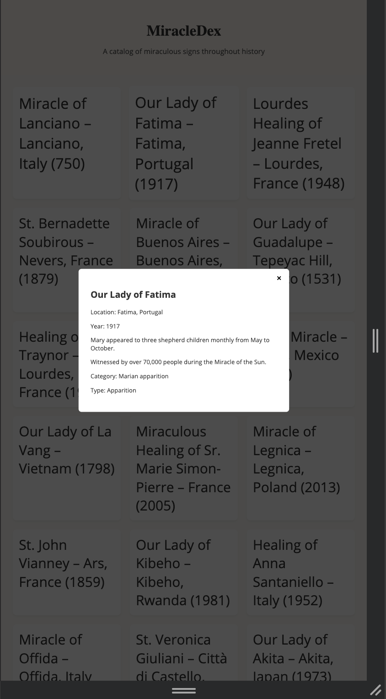

# ✨ MiracleDex Project Report

**Student Name: Frederick Oppong**

**Course: CSCI 270 – Web/Mobile App Development**

**Project Title: MiracleDex Website Project**

**Submission Date: Jun 11, 2025**

**GitHub Repo:  https://github.com/fredericoop12345/miracle-site**

**Live Site (GitHub Pages): https://fredericoop12345.github.io/miracle-site/**

---

## 🔷 Part 1 — HTML/CSS Layout and Responsive Design

### ✅ Requirements Addressed
- [✅] Landing page created with heading and container
- [✅] Used Flexbox or Grid layout
- [✅] Mobile-friendly design with media queries
- [✅] Elegant, reverent styling with a Google Font
- [✅] External CSS file used

### 📸 Screenshots
> On Desktop:

> On Phone Upon Clicking any miracle short card:

### 🔍 Code Snippets
> Include relevant HTML and CSS snippets here (layout structure, responsive styling, etc.).

This is the HTML
````
<!DOCTYPE html>
<html lang="en">
<head>
  <meta charset="UTF-8" />
  <title>MiracleDex</title>
  <link rel="stylesheet" href="miracleDex.css" />
</head>
<body>
<div class="heading">
  <h1>MiracleDex</h1>
  <p class="subtitle">A catalog of miraculous signs throughout history</p>
</div>

<div>
  <section id="miracle-grid" class="card-grid"></section>
  <button id="load-more-btn">Load More</button>
</div>

<div id="modal" class="modal hidden">
  <div class="modal-content">
    <button id="close-modal">×</button>
    <h2 id="modal-title"></h2>
    <p id="modal-location"></p>
    <p id="modal-year"></p>
    <p id="modal-summary"></p>
    <p id="modal-details"></p>
    <p id="modal-category"></p>
    <p id="modal-type"></p>
  </div>
</div>

<script src="miracleDex.js"></script>
</body>
</html>

````
This is the CSS
````
body {
  font-family: 'Open Sans', sans-serif;
  background-color: #fdfaf6;
  margin: 0;
  padding: 0;
  color: #333;
}

.heading {
  text-align: center;
  padding: 2rem 1rem;
  background-color: #fff8f0;
}

h1 {
  font-family: 'Playfair Display', serif;
  font-size: 2.5rem;
  margin-bottom: 0.25rem;
}

.subtitle {
  font-size: 1.2rem;
  color: #555;
}

.card-grid {
  display: grid;
  grid-template-columns: repeat(auto-fit, minmax(280px, 1fr));
  gap: 1.5rem;
  padding: 2rem;
}

.card {
  background: #fff;
  border-radius: 10px;
  padding: 1rem;
  box-shadow: 0 4px 6px rgba(0,0,0,0.05);
  cursor: pointer;
  transition: transform 0.2s ease-in-out;
}

.card:hover {
  transform: scale(1.02);
}

#load-more-btn {
  display: block;
  margin: 1rem auto 2rem;
  padding: 0.5rem 1.5rem;
  font-size: 1rem;
}

.modal {
  position: fixed;
  top: 0;
  left: 0;
  width: 100%;
  height: 100%;
  background: rgba(0,0,0,0.7);
  display: flex;
  justify-content: center;
  align-items: center;
}

.modal-content {
  background: white;
  padding: 2rem;
  border-radius: 8px;
  width: 90%;
  max-width: 500px;
  position: relative;
}

#close-modal {
  position: absolute;
  top: 10px;
  right: 14px;
  font-size: 1.5rem;
  background: none;
  border: none;
  cursor: pointer;
}

.hidden {
  display: none;
}

/* 📱 Media Queries */
@media (max-width: 600px) {
  h1 {
    font-size: 1.8rem;
  }

  .subtitle {
    font-size: 1rem;
  }

  .modal-content {
    padding: 1rem;
  }
}
````

### 🖋️ Reflection

Firstly, the most difficult challenge I faced was deploying the interactive logic of Javascript throughout the project. What challenges did you face in designing a responsive layout? What did you learn about structuring HTML/CSS for real-world use?

---

## 🔷 Part 2 — JavaScript + DOM + JSON Integration

### ✅ Requirements Addressed
- [✅] Fetched data from:
  `https://gist.githubusercontent.com/trevortomesh/7bbf97b2fbae96639ebf1a254b6a7a70/raw/miracles.json`
- [✅] Rendered miracle title, location, year, summary
- [✅] Used `fetch()` and `async/await`
- [✅] Implemented "Load More" or pagination
- [✅] Added modal or expandable section with full miracle details

### 📸 Screenshots
> Show your miracle cards and one expanded view or modal.


### 🔍 Code Snippets
This is my Javascipt code for the project
````
let miracles = [];
let currentIndex = 0;
const BATCH_SIZE = 6;

const grid = document.getElementById('miracle-grid');
const loadMoreBtn = document.getElementById('load-more-btn');
const modal = document.getElementById('modal');
const closeModalBtn = document.getElementById('close-modal');

async function loadMiracles() {
  try {
    const res = await fetch("https://gist.githubusercontent.com/trevortomesh/7bbf97b2fbae96639ebf1a254b6a7a70/raw/miracles.json");
    miracles = await res.json();
    showNextBatch();
  } catch (err) {
    console.error("Failed to fetch miracles:", err);
  }
}

function showNextBatch() {
  const nextBatch = miracles.slice(currentIndex, currentIndex + BATCH_SIZE);
  nextBatch.forEach(createCard);
  currentIndex += BATCH_SIZE;

  if (currentIndex >= miracles.length) {
    loadMoreBtn.style.display = 'none';
  }
}

function createCard(miracle) {
  const card = document.createElement('div');
  card.classList.add('card');

  card.textContent = `${miracle.title} – ${miracle.location} (${miracle.year})`;
  card.addEventListener('click', () => openModal(miracle));

  grid.appendChild(card);
}

function openModal(miracle) {
  document.getElementById('modal-title').textContent = miracle.title;
  document.getElementById('modal-location').textContent = `Location: ${miracle.location}`;
  document.getElementById('modal-year').textContent = `Year: ${miracle.year}`;
  document.getElementById('modal-summary').textContent = miracle.summary;
  document.getElementById('modal-details').textContent = miracle.details;
  document.getElementById('modal-category').textContent = `Category: ${miracle.category}`;
  document.getElementById('modal-type').textContent = `Type: ${miracle.type}`;
  modal.classList.remove('hidden');
}

closeModalBtn.addEventListener('click', () => modal.classList.add('hidden'));
loadMoreBtn.addEventListener('click', showNextBatch);

loadMiracles();
````

### 🖋️ Reflection
**What did you learn about asynchronous JavaScript? What debugging techniques did you use or discover?**

At this point, I cannot say the way I went about it was really involving debugging.
I am used to the two syntaxes of asynchronous functions and each of them had their own unique way to go about it.
The assigning of the await .json file to a variable feels more comfortable to me right now than the .then process.
I currently don't know if there is a situation where using the .then will be better than await but I feel the logic to all of them is so far the same.

---

## 🔷 Part 3 — GitHub Repository and Documentation

### ✅ Requirements Addressed
- [✅] GitHub repo created and pushed
- [✅] GitHub Pages deployed
- [✅] `README.md` contains project description, instructions, and screenshots

### 📎 Links
- **GitHub Repo: https://github.com/fredericoop12345/miracle-site**
- **Live GitHub Pages Site: https://fredericoop12345.github.io/miracle-site/**

### 🖋️ Reflection

Honestly, my work did not include consistent pushing of code to Github but I finished it and pushed it to Github.
Consistently committing is not so easy to do.

---

## 🧠 Final Reflection

If I am to explain to a friend what this project is about.
I would specifically mention it as more of getting adjusted to web development and the workflow of working on such a field.
I say this because although I learnt the html, css and Javascript, it is not until I understand that arranging these elements together will produce this or that effect.
For example, after finishing my Javascript file, I only had the load button and only after it is clicked will the miracle cards start to appear. 
It was not until I realized just defining the function will make them load but declaring it at the end to run is also necessary and even this has to be done with the effect I have to produce in mind.

---

<sub>Assignment created by Dr. Trevor Tomesh with assistance from ChatGPT. All source miracle data provided from public JSON: https://gist.github.com/trevortomesh/7bbf97b2fbae96639ebf1a254b6a7a70</sub>
